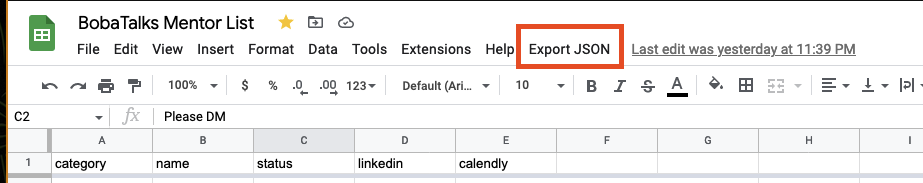
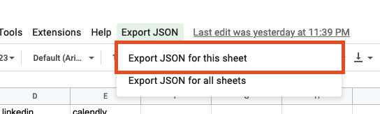
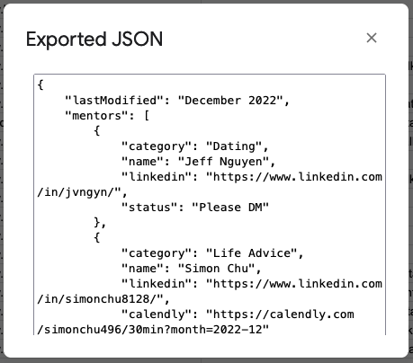
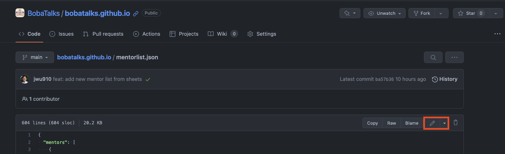
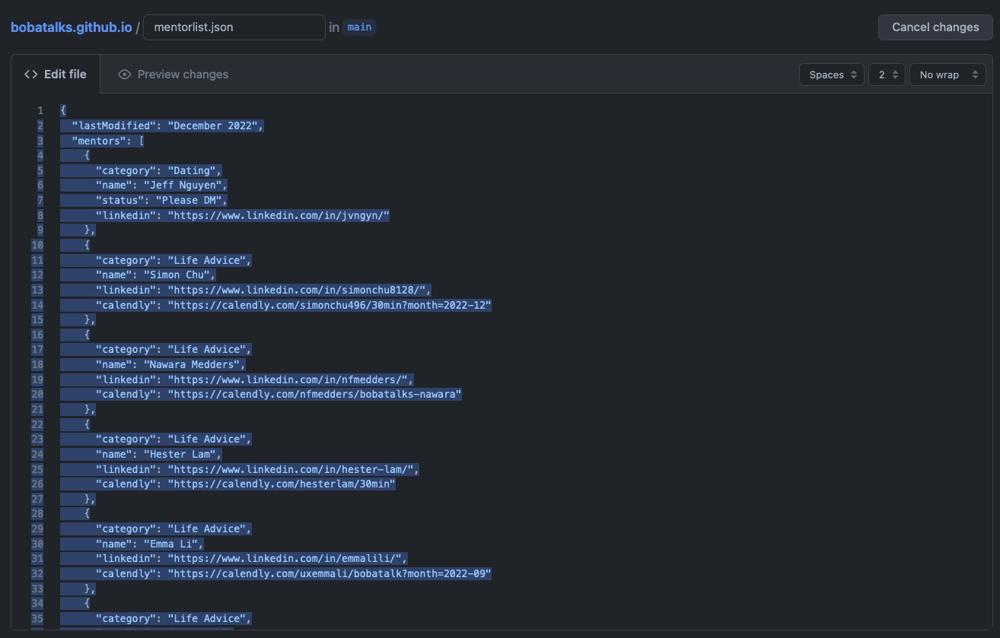
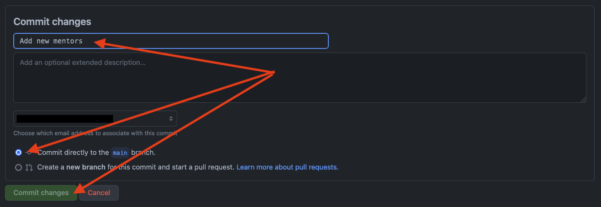

# BobaTalks Mentor List

- [BobaTalks Mentor List](#bobatalks-mentor-list)
  - [:gift: Browsing current mentors](#gift-browsing-current-mentors)
  - [:rocket: Adding New Mentors (access required)](#rocket-adding-new-mentors-access-required)
  - [:computer: Local Development](#computer-local-development)
  - [:pen: Notes](#pen-notes)
  - [:book: Additional Resources](#book-additional-resources)

## :gift: Browsing current mentors

Visit the current list at [BobaTalks Mentor List](https://bobatalks.github.io)

## :rocket: Adding New Mentors (access required)

1. Request access to the [Mentor list source file](https://docs.google.com/spreadsheets/d/1niDpc344z9BqAmOH8n_n9Wj92YCv6CQv2VA27Y42wh4/edit?usp=sharing)

2. Make changes to the source file and generate a new json string for the mentors list with the `Export JSON` button at the top of the workbook.

   

   

   - copy all generated json
   - _note: `ctrl/cmd + a` then `ctrl/cmd + c`_

   

3. Update the source file on GitHub

   - [Edit this file](https://github.com/BobaTalks/bobatalks.github.io/blob/main/mentorlist.json)

   

   - Paste the entire exported JSON into this new file
   - _note: `ctrl/cmd + a` then `ctrl/cmd + v`_

   

4. Save directly to production (_main_ branch) - GitHub Pages will automatically redeploy typically within a minute
   

## :computer: Local Development

1. [Fork](https://docs.github.com/en/get-started/quickstart/fork-a-repo) and clone this repository
2. Navigate to your local project root after cloning
3. Run `npx serve .` at project root to spin up local test server
4. [Sync your fork](https://docs.github.com/en/pull-requests/collaborating-with-pull-requests/working-with-forks/syncing-a-fork) with the upstream repo to ensure you are up to date with the latest changes
5. Make your code changes
6. [Commit](https://github.com/git-guides/git-commit) and [Push](https://github.com/git-guides/git-push) your code up to your fork
7. Open a [Pull Request](https://docs.github.com/en/pull-requests/collaborating-with-pull-requests/proposing-changes-to-your-work-with-pull-requests/creating-a-pull-request). Be sure to include any relevant screenshots or comments.

## :pen: Notes
- `/mentorlist.json` Can be modified for local testing, but should not be committed unless intending to modify the mentor list

## :book: Additional Resources

- [Generic Forking and Pull Request Workflow](https://gist.github.com/jwu910/0b7327c2c613f21d913bfae9ced57f04)

- [Git Guides](https://github.com/git-guides)
